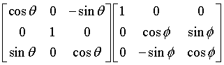

# SOAR_NSL_Navigation

## About
- Code to aim a camera from a lander ejected from alt. of 1 mile to a point on the ground
- Competing in the 2016-2017 NASA NSL ([NASA student Launch](http://www.usfsoar.com/projects/nsl-2016-2017/))
- Built by students in SOAR ([Society Of Aeronautics and Rockety](http://www.usfsoar.com/)) at USF ([University of South Florida](http://www.usf.edu/))

## Documentation
The code consists of several libraries along with the main `.ino` file, including `Lander` and `Timer`:

### `Lander` Library
While the primary program controls timing, checks, and initlization, the `Lander` library serves to control the functions of the lander itself, and as such includes the `landerDOF`, `landerServos`, and `landerGPS` libraries, as well as several functions:

#### Functions

* `float degToRad(int deg), degToRadFloat(float deg); int radToDeg(float rad)`

Self-explanatory utilities for converting degrees to radians and vice versa. We use the `degToRadFloat` for converting latitude and longitude degrees to radians because these need to be precise, but the camera angles are imprecise so they can be integer values.

* `int getNeededHeading(float currLoc[2], float neededLoc[2])`

Takes two points in `{float latitude, float longitude}` format and returns the heading in degrees from the first to the second, with 0 being north and angles measured counter-clockwise. Has a range of [-180, 180]. Uses the [forward azimuth formula](http://www.movable-type.co.uk/scripts/latlong.html#bearing) without conversion to normal compass bearings.

* `float getDistanceBetween(float locA[2], float locB[2])`

Takes two points in `{float latitude, float longitude}` format and returns the distance in meters, using the [haversine formula](http://www.movable-type.co.uk/scripts/latlong.html#bearing).

* `int * getCompensatedAngles(int hpr[3], float alt, float currentLoc[2], float targetLoc[2])`

Given the orientation (`hpr` in the format `{int heading, int pitch, int roll}`), altitude in meters, and current and target locations in `{float latitude, float longitude}` format, returns an array with pan (angle counter-clockwise from the x-axis of the landing module) and tilt (angle down from the xy-plane of the landing module) angles in degrees. Pan has a range of [-180,180] and tilt has a range of [-90,90], with -90 being the positive z-axis (up) and 90 being the negative z-axis (down).

_Math:_
This function works by first calculating the pan angle using the current heading and the target heading, then the distance, then performing a change in basis on the vector obtained by 〈dist\*cos(pan angle), dist\*sin(pan angle), -altitude〉. This is the vector from the lander to the point being aimed at. The matrices that are multiplied by the vector are shown below (where θ is the pitch angle (measured counter-clockwise about the y-axis, and φ is the roll angle (measured counter-clockwise about the *new* x-axis)): 
 
Finally, if the transformed vector is 〈x,y,z〉, the new pan angle (panPrime) is obtained with arctan(y/x) and the new tilt angle with arctan(y\*(-z)/sin(panPrime)). 

* `void pointTo(float targetLoc[2])`

Combines the data from the above functions, 10 degrees of freedom board, and the GPS sensor to point the servos at a specific point defined by `targetLoc` where `targetLoc` is an array in the format `{float latitude, float longitude}`.

* `bool init()`

Checks if the lander sucessfully initiated and returns a boolean value. For `true` to be returned, the GPS, 10 degrees of freedom sensor, and servo controller must initialize succesfully.

#### `landerDOF` Library
The `landerDOF` library processes data from the [Adafruit 10-DOF IMU Breakout](https://www.adafruit.com/product/1604) sensor, including altitude data from pressure and temperature, and magnetometer data. 

##### Functions
* `int * getCurrentOrientation()`

Returns an array with the current orientation in the format `{int heading, int pitch, int roll}`. These values are intrinsic Euler angles in degrees measured counter-clockwise about the x, y, and z axes respectively.

* `float getCurrentAltitude()`

Returns the current altitude in meters. **Note:** it is important to set the _ground level pressure_ using the `setGroundPressure` function in order for this data to be accurate.

* `bool init()`

Intitiates the 10 Degrees of Freedom sensors and sets the ground level pressure as a the pressure when `init()` is run. Will return false if any of the sensors fail to initialize or no valid ground level pressure is recieved.

#### `landerServos` Library
This library provides functions for servo control. There are two [Hitech 5625-MG](http://www.servodatabase.com/servo/hitec/hs-5625mg) servos attached to a [16-Channel 12-bit PWM Servo Controller](https://www.adafruit.com/product/815). The pan servo is referred to as `1` and tilt as `2` when setting angles and pins.

##### Functions
* `void setAngle(int servo, int angle)`

Takes a servo (`1` or `2` as defined above) and sets it to an angle in degrees, using the PWM constraints set in the library.

* `void setPin(int servo, int pin)`

Allows for easily changing the servo pin settings.

* `int constrainPWM(int val, int limitA, int limitB)`

Essentially the same as the standard [`constrain()`](https://www.arduino.cc/en/reference/constrain) function but does not require the constraints to be in order. Used for constraining arbitrarily ordered values, as we often want to `map` angles in reverse.

* `bool init()`

Initiates the PWM communication. Always returns true (does not check if servos are properly connected).

#### `landerGPS` Library
Provides functions for easily accessing GPS data from the GPS module.

**This is not currently enabled.**

##### Functions
* `float * getCurrentLatLon()`

Returns a two-item array in the format `{float latitude, float longitude}` with the most recently found GPS location of the lander.

* `bool init()`

Initiates communication with the GPS module.

### `Timer` Library
This library provides functions to manage the primary timer of the system, which allows for easy timing of behavior. Runs a timer in the background when started.

#### Functions and Variables
* `void pause(), reset(), start(), restart()`

Self-explanatory functions for managing timer behavior.

* `int64_t getElapsedTime()`

Returns the elapsed time since the timer was started.

* `bool isRunning`

Returns `true` if the timer is currently running. The timer will not be running if any initiation processes fail.